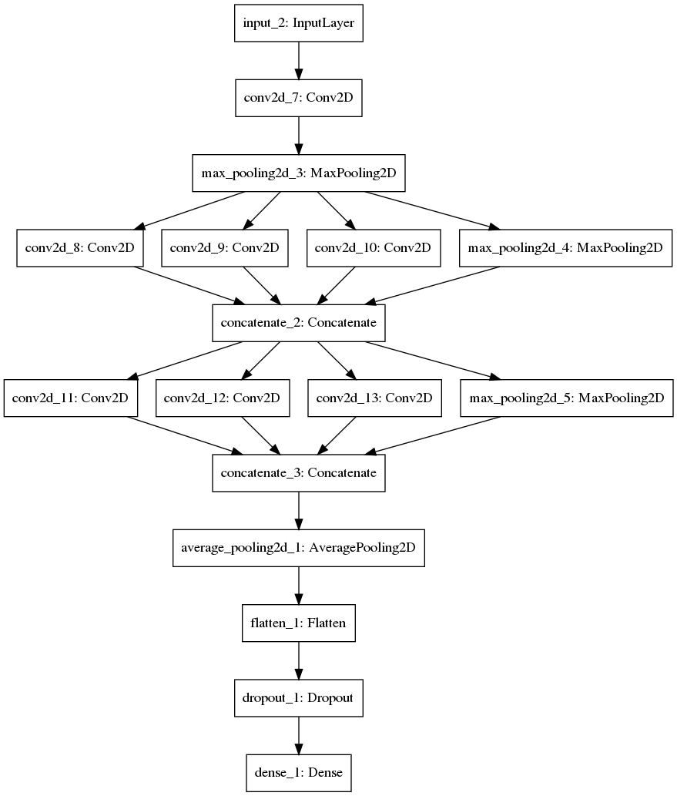

# Brain-Tumour-Detection
An Inception inspired neural network which can identify tumours in Brain MRI Scans

## Dataset
The dataset used for this [Brain MRI images for Brain Tumour detection](https://www.kaggle.com/navoneel/brain-mri-images-for-brain-tumor-detection)
If you glance at the dataset, you will find that the naming scheme is not uniform and niether is the directory structure. The
image sizes are also different. Therefore I first cropped the images to enhance the scans and saved them to a proper directory structure
([Processed_dataset](Processed_dataset))

## Model

As shown in the figure above the first layer is a regular convolutional layer followed by a maxpool followed by 2 *Naive inception blocks*
stacked one on top of the other. The reason for choosing naive ones is that since the model is only doing binary
classification with a very lightweight dataset, hence need for filter control is not required that much.
After these blocks, we have a layer of average pooling followed by flattening and adding dense layer accompanied by a dropout of 20%

Learn more about Inception architecture [here](https://arxiv.org/abs/1512.00567)

Accuracy: 84.46%
